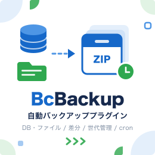

<p align="center">
  
</p>

# BcBackup

baserCMS 5 用のバックアッププラグインです。データベースとアップロードファイルを ZIP にまとめ、管理画面のボタンからでも cron からでも実行できます。

## 主な機能

- **DB バックアップ** … 標準方式（コア機能でスキーマ＋CSV を出力。外部コマンド不要・自動リストア可）／ネイティブ方式（mysqldump・pg_dump・SQLite ファイルコピー）を選択
- **ファイルのバックアップ** … 対象ディレクトリは自由に指定（初期値 `webroot/files`）。2回目以降は差分のみ保存
- **世代管理** … 保持世代数・保持日数で自動削除。差分はフルとセットのチェーン単位で管理
- **実行方法** … 管理画面（バックグラウンド実行＋進捗表示）と CLI。cron で定期実行
- **リストア** … CLI から DB とファイルをまとめて書き戻し
- バックアップ中はメンテナンスモードへ自動切替。多重実行の防止・空き容量チェック・ZIP の原子的書き込みにも対応

## 動作環境

| | |
| --- | --- |
| baserCMS | 5.3 / 5.4 |
| PHP | 8.1 以上（`ext-zip` 必須） |
| DB | MySQL / MariaDB / PostgreSQL / SQLite |

外部ライブラリには依存していないため、`composer install` は不要です。

## インストール

1. `plugins/BcBackup` を配置
2. 管理画面 > プラグイン管理 から「バックアップ」を有効化（`bc_backup_configs` テーブルが作成されます）
3. 管理画面 > プラグイン > バックアップ で保存先などを設定

## 使い方

```bash
bin/cake bc_backup run --full      # フルバックアップ
bin/cake bc_backup run --diff      # 差分バックアップ（files のみ差分、DB は毎回フル）
bin/cake bc_backup list            # 一覧
bin/cake bc_backup restore <name>  # リストア（確認プロンプトあり。--force でスキップ）
```

### 定期実行（cron）

```cron
# 毎日 3:00 に差分、毎週日曜 2:00 にフル
0 3 * * 1-6 cd /path/to/app && bin/cake bc_backup run --diff >> /var/log/bc_backup.log 2>&1
0 2 * * 0   cd /path/to/app && bin/cake bc_backup run --full >> /var/log/bc_backup.log 2>&1
```

サイトの実パス入りの記述例が管理画面に表示されるので、そのままコピーして使えます。失敗時は stderr へ出力し非 0 で終了するため、`MAILTO` によるメール通知がそのまま機能します。

## 注意事項

- バックアップファイルにはサイトのデータが丸ごと入ります。Web から直接ダウンロードできる場所には置かないでください（webroot 配下を指定した場合 `.htaccess` を自動設置しますが、nginx では機能しません）
- **リストアは CLI のみ**です。管理画面にリストアボタンはありません
- 管理画面からの実行には `exec` / `proc_open` が必要です（禁止環境では実行ボタンを表示せず、cron での実行を案内します）
- データ量の多いサイトは管理画面からだとタイムアウトすることがあります。cron での定期実行を推奨します
- メンテナンスモードは管理者のログイン中や debug モードでは効かないため、書き込みを完全に止めるものではありません
- `--single-transaction` が整合を保証するのは InnoDB のみです（MyISAM 混在時はメンテナンスモードの併用が保険になります）

<details>
<summary><b>リストアの詳細</b></summary>

- **標準方式の DB** … `bc_backup restore <name>` で自動リストア（drop → create → CSV 投入 → シーケンス更新）
- **ネイティブ方式の DB** … 自動リストア対象外。ダンプファイルを取り出し、手動リストア手順（`mysql < dump.sql` / `psql < dump.sql` / SQLite ファイル差し替え）を表示します
- **files** … チェーン（フル＋差分）を連番順に上書き展開し、各差分の削除ファイル一覧を適用します

### 手動で files を展開する場合

1. 対象チェーンのフル ZIP と、復元したい時点までの差分 ZIP をダウンロード
2. フル ZIP 内の `files/` をサイトルートに上書き展開
3. 差分 ZIP を連番順に同様に上書き展開
4. 各差分 ZIP 内 `manifest.json` の `deleted` に列挙されたファイルを削除

</details>

<details>
<summary><b>保存形式</b></summary>

```
backup/
  20260712_020000_full.zip                        # チェーンの起点（フル）
  20260713_030000_diff_20260712_020000_001.zip    # 同チェーンの差分 #1
  catalog.json                                    # 管理台帳（DB には持たない）
```

各 ZIP には `manifest.json`（種別・チェーン ID・連番・ファイル一覧・削除一覧・バージョン情報）を同梱しています。`catalog.json` が壊れた場合は ZIP のスキャンから自動再構築されます。

</details>

## License

[MIT License](LICENSE)

## Thanks

- [basercms.net](https://basercms.net/)
- [wiki.basercms.net](http://wiki.basercms.net/)
- [cakephp.jp](http://cakephp.jp)
